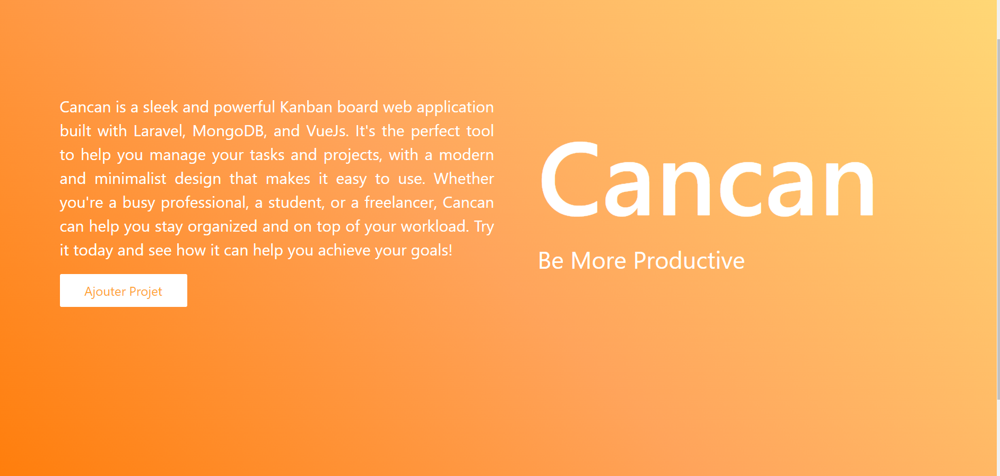

# Cancan - Kanban Board Web Application

Cancan is a powerful and sleek Kanban board web application that I developed using Laravel,
 MongoDB, and Vue.js. This project provided me with a great opportunity to learn how to build
 APIs using Laravel and to work with MongoDB as my database for the first time. I also gained
 valuable experience in front-end development using Vue.js. Cancan is a user-friendly and intuitive
 tool that enables teams to easily manage their workflow, track progress, and collaborate effectively.
 I am proud of the results I achieved with Cancan and look forward to developing more innovative and
 efficient solutions in the future.
 
## Screenshot

